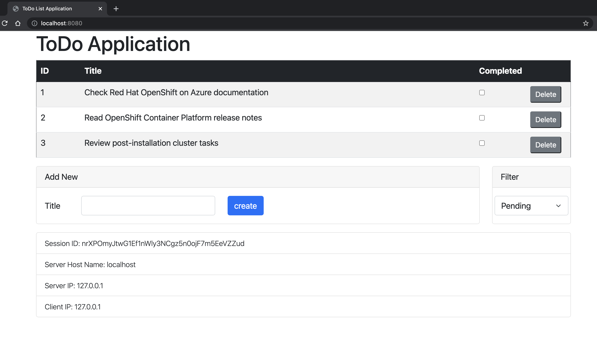
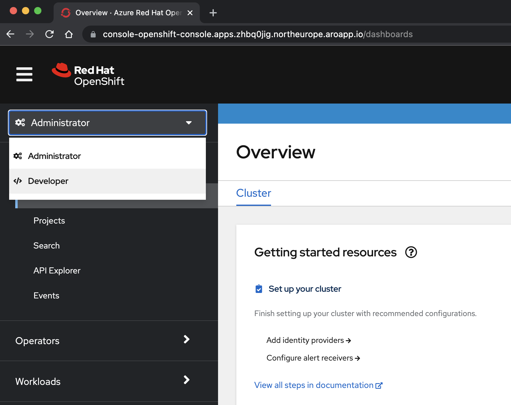
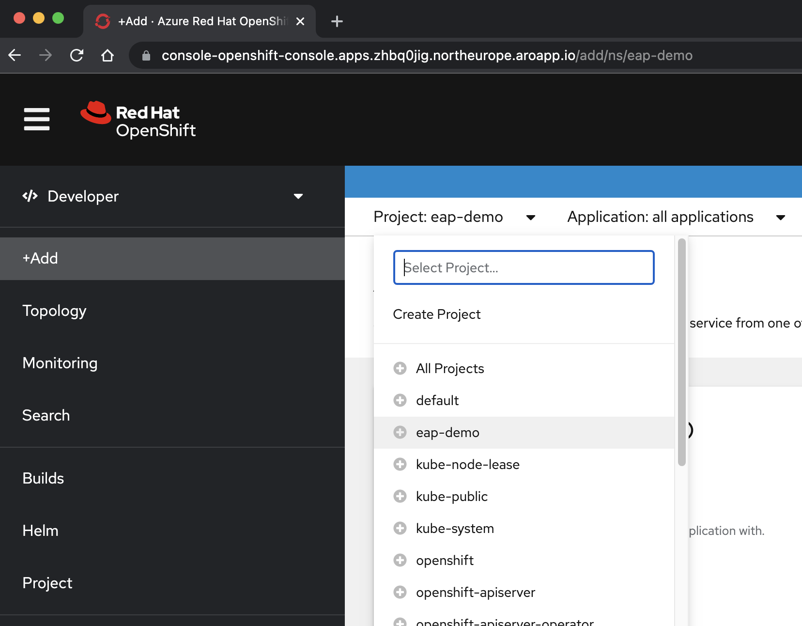
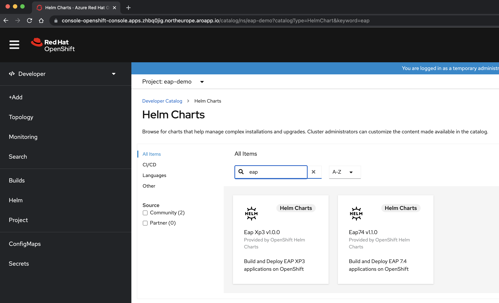
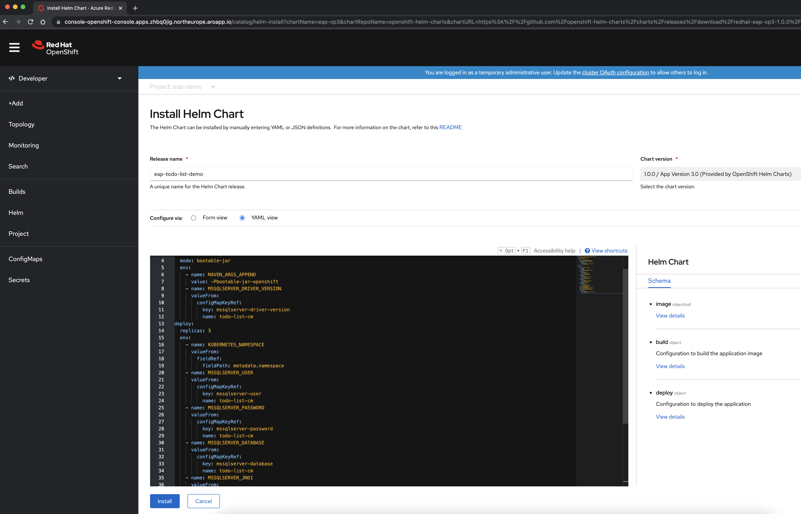
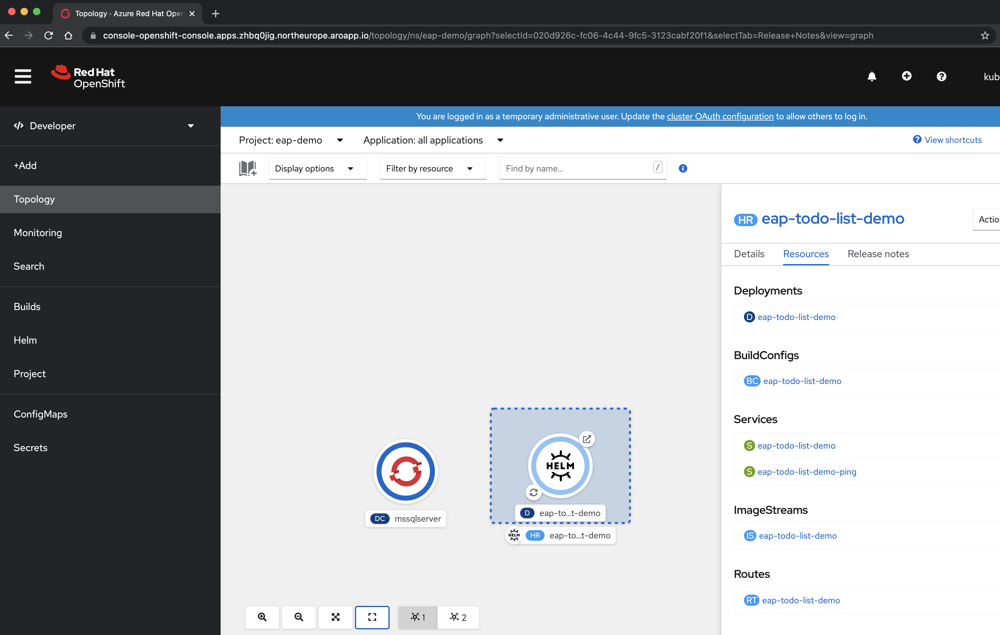
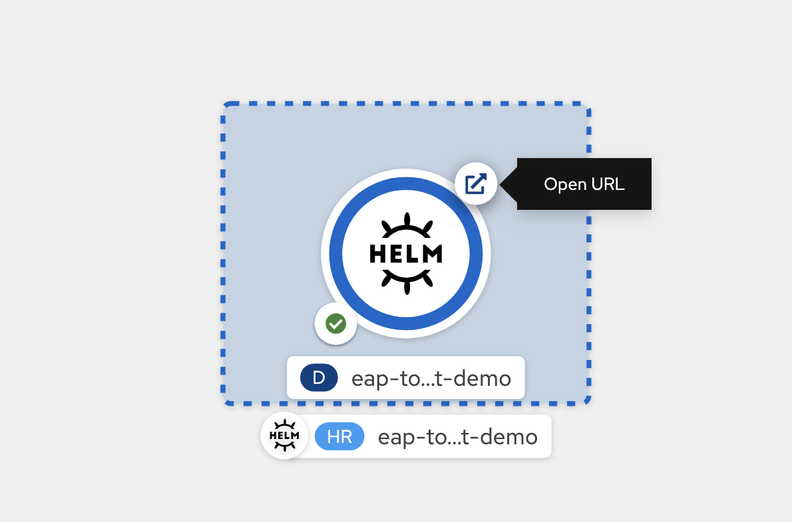

# Deploy a Java application with Red Hat JBoss Enterprise Application Platform on an Azure Red Hat OpenShift 4 cluster

This guide demonstrates how to deploy a Jakarta EE 8 application running on Red Hat JBoss Enterprise Application Platform (JBoss EAP) that connects to a Microsoft SQL Server to an Azure Red Hat OpenShift (ARO) 4 cluster by using [EAP Helm Charts](https://jbossas.github.io/eap-charts).

The guide takes a traditional Jakarta EE 8 application and walks you through the process of migrating it to a container orchestrator like Red Hat OpenShift running on Azure. First, it describes how you can package your application as a [Bootable JAR](https://access.redhat.com/documentation/en-us/red_hat_jboss_enterprise_application_platform/7.4/html/using_jboss_eap_xp_3.0.0/the-bootable-jar_default) to run it locally, connecting the application to a docker Microsoft SQL Server Container. Finally, it shows you how you can deploy the Microsoft SQL Server on OpenShift and how to deploy three replicas of the JBoss EAP application by using Helm Charts.

The application is a stateful application that stores information in a HTTP Session. It makes use of the JBoss EAP clustering capabilities and uses the following Jakarta EE 8 and MicroProfile 4.0 technologies:
* Jakarta Server Faces
* Jakarta Enterprise Beans
* Jakarta Persistence
* MicroProfile Health

> [!IMPORTANT]
> This article uses a Microsoft SQL Server docker image running on a Linux container on Red Hat OpenShift. Before choosing to run a SQL Server container for production use cases, please review the [support policy for SQL Server Containers](https://support.microsoft.com/help/4047326/support-policy-for-microsoft-sql-server) to ensure that you are running on a supported configuration.

> [!IMPORTANT]
> While ARO is jointly engineered, operated, and supported by Red Hat and Microsoft to provide an integrated support experience, the software you run on top of ARO, including that described in this article, is subject to its own support and license terms. For details about support of ARO, see [Support lifecycle for Azure Red Hat OpenShift 4](../support-lifecycle.md). For details about support of the software described in this article, see the main pages for that software as listed in the article.
> * For support for JBoss Enterprise Application Platform, please go to [Red Hat JBoss Enterprise Application Platform](https://www.redhat.com/en/technologies/jboss-middleware/application-platform).

## Prerequisites

> [!NOTE]
> Azure Red Hat OpenShift requires a minimum of 40 cores to create and run an OpenShift cluster. The default Azure resource quota for a new Azure subscription does not meet this requirement. To request an increase in your resource limit, see [Standard quota: Increase limits by VM series](../azure-portal/supportability/per-vm-quota-requests.md). Note that the free trial subscription isn't eligible for a quota increase, [upgrade to a Pay-As-You-Go subscription](../cost-management-billing/manage/upgrade-azure-subscription.md) before requesting a quota increase.

1. Prepare a local machine with Unix-like operating system installed (for example, Fedora, RHEL, macOS).
1. Install a Java SE implementation (for example, [Oracle JDK 11](https://www.oracle.com/java/technologies/downloads/#java11)).
1. Install [Maven](https://maven.apache.org/download.cgi) 3.6.3 or higher.
1. Install [Docker](https://docs.docker.com/get-docker/) for your OS.
1. Install [Azure CLI](/cli/azure/install-azure-cli) 2.29.2 or later.
1. Clone the code for this demo application (todo-list) to your local system. The demo application is at [GitHub](https://github.com/yersan/todo-list).
1. Follow the instructions in [Create an Azure Red Hat OpenShift 4 cluster](./tutorial-create-cluster.md).

   Though the "Get a Red Hat pull secret" step is labeled as optional, **it is required for this article**.  The pull secret enables your ARO cluster to find the JBoss EAP application images.

   If you plan to run memory-intensive applications on the cluster, specify the proper virtual machine size for the worker nodes using the `--worker-vm-size` parameter. For more information, see:

   * [Azure CLI to create a cluster](/cli/azure/aro#az_aro_create)
   * [Supported virtual machine sizes for memory optimized](./support-policies-v4.md#memory-optimized)

1. Connect to the cluster by following the steps in [Connect to an Azure Red Hat OpenShift 4 cluster](./tutorial-connect-cluster.md).
   * Follow the steps in "Install the OpenShift CLI" 
   * Connect to an Azure Red Hat OpenShift cluster using the OpenShift CLI with the user `kubeadmin`

1. Execute the following command to create the OpenShift project for this demo application:

    ```bash
    $ oc new-project eap-demo
    Now using project "eap-demo" on server "https://api.zhbq0jig.northeurope.aroapp.io:6443".

    You can add applications to this project with the 'new-app' command. For example, try:

    oc new-app rails-postgresql-example

    to build a new example application in Ruby. Or use kubectl to deploy a simple Kubernetes application:

    kubectl create deployment hello-node --image=k8s.gcr.io/serve_hostname
    ```

1. Execute the following command to add the view role to the default service account. This role is needed so the application can discover other pods and form a cluster with them:

    ```bash
    $ oc policy add-role-to-user view system:serviceaccount:$(oc project -q):default -n $(oc project -q)
    clusterrole.rbac.authorization.k8s.io/view added: "system:serviceaccount:eap-demo:default"
    ```

## Prepare the application

At this stage, you have cloned the demo application and your local repository is on the `main` branch. The demo application is a simple Jakarta EE 8 application that creates, reads, updates, and deletes records on a Microsoft SQL Server. This application can be deployed as it is on a JBoss EAP server installed in your local machine. You have to configure the server with the required database driver and data source. You also need a database server available in your local environment.

However, when you are targeting OpenShift, you might want to trim the capabilities of your JBoss EAP server; for example, to reduce the security exposure of the provisioned server and reduce the overall footprint. You could also want to include some MicroProfile specs to make your application more suitable for running on an OpenShift environment. When using JBoss EAP, one way to accomplish this is by packaging your application and your server in a single deployment unit known as a Bootable JAR. Let's do that by adding the required changes to our demo application.

Navigate to your demo application local repository and change the branch to `bootable-jar`:

```bash
todo-list (main) $ git checkout bootable-jar
Switched to branch 'bootable-jar'
todo-list (bootable-jar) $
```

Let's do a quick review about what we have changed:

1. We have added the `wildfly-jar-maven` plugin to provision the server and the application in a single executable JAR file. The OpenShift deployment unit will be now our server with our application.
1. On the maven plugin, we have specified a set of Galleon layers. This configuration allows us to trim the server capabilities to only what we need.
1. Our application uses Jakarta Faces with Ajax requests, which means there will be information stored in the HTTP Session. We don't want to lose such information if a pod is removed. We could save this information on the client and send it back on each request. However, there are cases where you may decide not to distribute certain information to the clients. For this demo, we have chosen to replicate the session across all pod replicas. To do it, we have added `<distributable />` to the `web.xml` that together with the server clustering capabilities will make the HTTP Session distributable across all pods.
1. We have added two MicroProfile Health Checks that allow identifying when the application is live and ready to receive requests.


## Run the application locally

Before deploying the application on OpenShift, we are going to run it locally to verify how it works. For the database, we are going to use a containerized Microsoft SQL Server running on Docker.

### Run the Microsoft SQL database on Docker

Follow the next steps to get the database server running on Docker and configured for the demo application:

1. Start a Docker container running the Microsoft SQL Server. You can get more information about this procedure by checking [this](https://docs.microsoft.com/en-us/sql/linux/quickstart-install-connect-docker) guide.

    ```bash
    $ sudo docker run \
    -e 'ACCEPT_EULA=Y' \
    -e 'SA_PASSWORD=Passw0rd!' \
    -p 1433:1433 --name mssqlserver -h mssqlserver \
    -d mcr.microsoft.com/mssql/server:2019-latest
    ```

1. Login into the server and create the `todos_db` database. This database name is expected by the demo application.

    ```bash
    $ sudo docker exec -it mssqlserver "bash"
    mssql@mssqlserver:/$ /opt/mssql-tools/bin/sqlcmd -S localhost -U SA -P 'Passw0rd!'
    1> CREATE DATABASE todos_db
    2> GO
    1> exit
    mssql@mssqlserver:/$ exit
    ```

### Run the demo application locally

Follow the next steps to build and run the application locally.

1. Build the Bootable JAR. When we are building the Bootable JAR, we need to specify the database driver version we want to use:
 
    ```bash
    todo-list (bootable-jar) $ MSSQLSERVER_DRIVER_VERSION=7.4.1.jre11 \
    mvn clean package
    ```

1. Launch the Bootable JAR by using the following command. When we are launching the application, we need to pass the required environment variables to configure the data source:

    ```bash
    todo-list (bootable-jar) $ MSSQLSERVER_USER=SA \
    MSSQLSERVER_PASSWORD=Passw0rd! \
    MSSQLSERVER_JNDI=java:/comp/env/jdbc/mssqlds \
    MSSQLSERVER_DATABASE=todos_db \
    MSSQLSERVER_HOST=localhost \
    MSSQLSERVER_PORT=1433 \
    mvn wildfly-jar:run
    ```

1. (Optional) If you want to verify the clustering capabilities, you can also launch more instances of the same application by passing to the Bootable JAR the `jboss.node.name` argument and, to avoid conflicts with the port numbers, shifting the port numbers by using `jboss.socket.binding.port-offset`. For example, to launch a second instance that will represent a new pod on OpenShift, you can execute the following command in a new terminal window:
    
    ```bash  
    todo-list (bootable-jar) $ MSSQLSERVER_USER=SA \
    MSSQLSERVER_PASSWORD=Passw0rd! \
    MSSQLSERVER_JNDI=java:/comp/env/jdbc/mssqlds \
    MSSQLSERVER_DATABASE=todos_db \
    MSSQLSERVER_HOST=localhost \
    MSSQLSERVER_PORT=1433 \
    mvn wildfly-jar:run -Dwildfly.bootable.arguments="-Djboss.node.name=node2 -Djboss.socket.binding.port-offset=1000"
    ```

    If your cluster is working, you will see on the server console log a trace similar to the following one:

    ```
    INFO  [org.infinispan.CLUSTER] (thread-6,ejb,node) ISPN000094: Received new cluster view for channel ejb
    ``` 

    > [!NOTE]
    > By default the Bootable JAR configures the JGroups subsystem to use the UDP protocol and sends messages to discover other cluster members to the 230.0.0.4 multicast address. To properly verify the clustering capabilities on your local machine, your Operating System should be capable of sending and receiving multicast datagrams and route them to the 230.0.0.4 IP through your ethernet interface. Check your network configuration and verify whether is working if you see warnings related to the cluster on the server logs.
    

1. Open `http://localhost:8080/` in your browser to visit the application home page. If you have created more instances, you can access them by shifting the port number, for example `http://localhost:9080/`. The application will look similar to the following image:

    

1. Check the application health endpoints (live and ready). These endpoints will be used by OpenShift to verify when your pod is live and ready to receive user requests:

   ```bash  
    todo-list (bootable-jar) $ curl http://localhost:9990/health/live
    {"status":"UP","checks":[{"name":"SuccessfulCheck","status":"UP"}]}

    todo-list (bootable-jar) $ curl http://localhost:9990/health/ready
    {"status":"UP","checks":[{"name":"deployments-status","status":"UP","data":{"todo-list.war":"OK"}},{"name":"server-state","status":"UP","data":{"value":"running"}},{"name":"boot-errors","status":"UP"},{"name":"DBConnectionHealthCheck","status":"UP"}]}
    ```

1. Press **Control-C** to stop the application.
1. Execute the following command to stop the database server:

    ```bash
    docker stop mssqlserver
    ```

1. If you don't plan to use the Docker database again, execute the following command to remove the database server from your Docker registry:

    ```bash
    docker rm mssqlserver
    ```

## Deploy to OpenShift

Before deploying the demo application on OpenShift we will deploy the database server. The database server will be deployed by using a [DeploymentConfig OpenShift API resource](https://docs.openshift.com/container-platform/4.8/applications/deployments/what-deployments-are.html#deployments-and-deploymentconfigs_what-deployments-are). The database server deployment configuration is available as a YAML file in the application source code.

To deploy the application, we are going to use the JBoss EAP Helm Charts that are already available in ARO. We also need to supply the desired configuration, for example, the database user, the database password, the driver version we want to use, and the connection information used by the data source. Since this information contains sensitive information, we will use [OpenShift Secret objects](https://docs.openshift.com/container-platform/4.8/nodes/pods/nodes-pods-secrets.html#nodes-pods-secrets-about_nodes-pods-secrets) to store it.

> [!NOTE]
> You can also use the JBoss EAP Operator to deploy this example, however, notice that the JBoss EAP Operator will deploy the application as `StatefulSets`. Use the JBoss EAP Operator if your application requires one or more one of the following.
>
> - Stable, unique network identifiers.
> - Stable, persistent storage.
> - Ordered, graceful deployment and scaling.
> - Ordered, automated rolling updates.
> - Transaction recovery facility when a pod is scaled down or crashes.

Navigate to your demo application local repository and change the current branch to `bootable-jar-openshift`:

```bash
todo-list (bootable-jar) $ git checkout bootable-jar-openshift
Switched to branch 'bootable-jar-openshift'
todo-list (bootable-jar-openshift) $
```

Let's do a quick review about what we have changed:

1. We have added a new maven profile named `bootable-jar-openshift` that prepares the Bootable JAR with a specific configuration for running the server on the cloud, for example, it enables the JGroups subsystem to use TCP requests to discover other pods by using the KUBE_PING protocol.
1. We have added a set of configuration files in the `todo-list/deployment` directory. In this directory, you will find the configuration files to deploy the database server and the application.

### Deploy the database server on OpenShift

The file to deploy the Microsoft SQL Server to OpenShift is `todo-list/deployment/mssqlserver/mssqlserver.yaml`. This file is composed by three configuration objects:
- A Service: To expose the SQL server port.
- A DeploymentConfig: To deploy the SQL server image.
- A PersistentVolumeClaim: To reclaim persistent disk space for the database. It uses the storage class named `managed-premium` which is available at your ARO cluster.

This file expects the presence of an OpenShift Secret object named `mssqlserver-secret` to supply the database administrator password. In the next steps, we will use the OpenShift CLI to create this Secret, deploy the server and create the `todos_db`:

1. To create the Secret object with the information relative to the database, execute the following command on the `eap-demo` project created before at the pre-requisite steps section:

    ```bash
    todo-list (bootable-jar-openshift) $ oc create secret generic mssqlserver-secret \
    --from-literal db-password=Passw0rd! \
    --from-literal db-user=sa \
    --from-literal db-name=todos_db
    secret/mssqlserver-secret created
    ```

1. Deploy the database server by executing the following:

    ```bash
    todo-list (bootable-jar-openshift) $ oc apply -f ./deployment/msqlserver/mssqlserver.yaml
    service/mssqlserver created
    deploymentconfig.apps.openshift.io/mssqlserver created
    persistentvolumeclaim/mssqlserver-pvc created
    ```

1. Monitor the status of the pods and wait until the database server is running:

    ```bash
    todo-list (bootable-jar-openshift *) $ oc get pods -w
    NAME                   READY   STATUS      RESTARTS   AGE
    mssqlserver-1-deploy   0/1     Completed   0          34s
    mssqlserver-1-gw7qw    1/1     Running     0          31s
    ```

1. Connect to the database pod and create the database `todos_db`:

    ```bash
    todo-list (bootable-jar-openshift) $ oc rsh mssqlserver-1-gw7qw
    sh-4.4$ /opt/mssql-tools/bin/sqlcmd -S localhost -U SA -P 'Passw0rd!'
    1> CREATE DATABASE todos_db
    2> GO
    1> exit
    sh-4.4$ exit
    exit
    ```

### Deploy the application on OpenShift

Now that we have the database server ready, we can deploy the demo application via JBoss EAP Helm Charts. The Helm Chart application configuration file is available at `todo-list/deployment/application/todo-list-helm-chart.yaml`. You could deploy this file via the command line; however, to do so you would need to have Helm Charts installed on your local machine. Instead of using the command line, the next steps explain how you can deploy this Helm Chart by using the OpenShift web console.

Before deploying the application, let's create the expected Secret object that will hold specific application configuration. The Helm Chart will get the database user, password and name from the `mssqlserver-secret` Secret created before, and the driver version, the datasource JNDI name and the cluster password from the following Secret:

1. Execute the following to create the application config map:

    ```bash
    todo-list (bootable-jar-openshift) $ oc create secret generic todo-list-secret \
    --from-literal app-driver-version=7.4.1.jre11 \
    --from-literal app-ds-jndi=java:/comp/env/jdbc/mssqlds \
    --from-literal app-cluster-password=mut2UTG6gDwNDcVW
    ```

    > [!NOTE]
    > You decide the cluster password you want to use, the pods that want to join to your cluster need such a password. Using a password prevents that any pods that are not under your control can join to your JBoss EAP cluster.

    > [!NOTE]
    > You may have noticed from the above Secret that we are not supplying the database Hostname and Port. That's not necessary. If you take a closer look at the Helm Chart application file, you will see that the database Hostname and Port are passed by using the following notations \$(MSSQLSERVER_SERVICE_HOST) and \$(MSSQLSERVER_SERVICE_PORT). This is a standard OpenShift notation that will ensure the application variables (MSSQLSERVER_HOST, MSSQLSERVER_PORT) get assigned to the values of the pod environment variables (MSSQLSERVER_SERVICE_HOST, MSSQLSERVER_SERVICE_PORT) that are available at runtime. These pod environment variables are passed by OpenShift when the pod is launched. These variables are available to any pod because we have created a Service to expose the SQL server in the previous steps.

2. Open the OpenShift console and navigate to the developer view (in the `</> Developer` perspective in the left hand menu)

    

3. Once you are in the `</> Developer` perspective, ensure you have selected the `eap-demo` project at the `Project` combo box.

    

4. Click on `+Add`, then Helm Chart. You will arrive at the Helm Chart catalog available on your ARO cluster. Write `eap` on the filter input box to filter all the Helm Charts and get the EAP ones. At this stage, you should see two options:

    

5. Since our application uses MicroProfile capabilities, you have to select for this demo the Helm Chart for EAP XP (at the time of this writing, the exact version of the Helm Chart is EAP Xp3 v1.0.0). The `Xp3` stands for Expansion Pack version 3.0.0. With the JBoss Enterprise Application Platform expansion pack, developers can use Eclipse MicroProfile application programming interfaces (APIs) to build and deploy microservices-based applications.

6. Click on the `EAP Xp` Helm Chart, and then on `Install Helm Chart` button.

At this point, we need to configure the chart to be able to build and deploy the application:

1. Change the name of the release to `eap-todo-list-demo`. 
1. We can configure the Helm Chart either using a `Form View` or a `YAML View`. Check the `YAML View` radio button in the `Configure via` box.
1. Then, change the YAML content to configure the Helm Chart by copying the content of the Helm Chart file available at `todo-list/deployment/application/todo-list-helm-chart.yaml` instead of the existing content:

   

1. Finally, click on the `Install` button to start the installation. This will open the `Topology view` with a graphical representation of the Helm release (named eap-todo-list-demo) and its associated resources.

    

    The Helm Release (abbreviated HR) is named `eap-todo-list-demo`. It includes a Deployment resource (abbreviated D) also named `eap-todo-list-demo`. 

1. When the build is finished (the bottom-left icon will display a green check) and the application is deployed (the circle outline is in dark blue), you can go to application the URL (using the top-right icon) from the route associated to the deployment.

    

1. The application is opened in your browser looking similar to the following image ready to start using it:

    

1. The application shows you the name of the pod which has served the information. To verify the clustering capabilities, you could add some Todos. Then delete the pod with the name indicated in the `Server Host Name` field that appears on the application `(oc delete pod <pod name>)`, and once deleted, create a new Todo on the same application window. You will see that the new Todo is added via an Ajax request and the `Server Host Name` field now shows a different name. Behind the scenes, the new request has been dispatched by the OpenShift load balancer and delivered to an available pod. The Jakarta Faces view has been restored from the HTTP Session copy stored in the pod which is now processing the request. Indeed you will see that the `Session ID` field has not changed. If the session were not replicated across your pods, you would get a Jakarta Faces ViewExpiredException.

## Clean up resources

### Delete the application

If you only want to delete your application, you can open the OpenShift console and, at the developer view, navigate to the `Helm` menu option. On this menu, you will see all the Helm Chart releases installed on your cluster. 

   

Locate the `eap-todo-list-demo` Helm Chart and at the end of the row, click on the tree dots to open the action contextual menu entry.

Click on "Uninstall Helm Release" to remove the application. Notice that the secret object used to supply the application configuration is not part of the chart. You need to remove it separately if you no longer need it.

Execute the following command if you want to delete the secret that holds the application configuration:

```bash
todo-list (bootable-jar-openshift) $ oc delete secrets/todo-list-secret
secret "todo-list-secret" deleted
```

### Delete the database

If you want to delete the database and the related objects, execute the following command:

```bash
todo-list (bootable-jar-openshift) $ oc delete all -l app=mssql2019
replicationcontroller "mssqlserver-1" deleted
service "mssqlserver" deleted
deploymentconfig.apps.openshift.io "mssqlserver" deleted

todo-list (bootable-jar-openshift) $ oc delete secrets/mssqlserver-secret
secret "mssqlserver-secret" deleted
```

### Delete the OpenShift project

You can also delete all the configuration created for this demo by deleting the `eap-demo` project. To do so, execute the following:

```bash
todo-list (bootable-jar-openshift) $ oc delete project eap-demo
project.project.openshift.io "eap-demo" deleted
```

### Delete the ARO cluster

Delete the ARO cluster by following the steps in [Tutorial: Delete an Azure Red Hat OpenShift 4 cluster](./tutorial-delete-cluster.md)

## Next steps

In this guide, you learned how to:
> [!div class="checklist"]
>
> * Prepare an EAP application for OpenShift.
> * Run it locally
> * Run the containerized application and a Microsoft SQL Server on an ARO 4

You can learn more from references used in this guide:

* [Red Hat JBoss Enterprise Application Platform](https://www.redhat.com/en/technologies/jboss-middleware/application-platform)
* [EAP Helm Charts](https://jbossas.github.io/eap-charts/)
* [Azure Red Hat OpenShift](https://azure.microsoft.com/services/openshift/)
